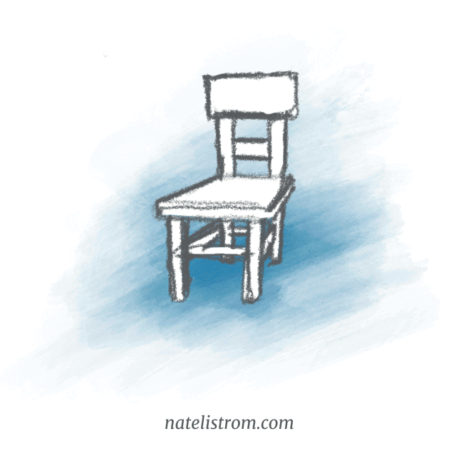

# About

👋 Hello, dear reader.

I'm Nate, a designer ([LinkedIn](https://www.linkedin.com/in/natelistrom/)), storytelling enthusiast, and aspiring [fiction](https://www.natelistrom.com/stories.html) writer.

In my [notes](https://www.natelistrom.com/notes.html) here, I explore ideas to help you hone your storytelling craft. My focus is long-form fiction, but the concepts apply broadly.

I publish once per month, and you can [sign up](https://www.natelistrom.com/subscribe.html) to get the latest notes as soon as they're published.

## Ergonomic storytelling

Based on my more than fifteen years of experience as a professional designer, I'm convinced that the most impactful, effective stories work because _they're fitted to us_.

A good chair fits your body. It's the right height for you to place your feet on the floor comfortably. It supports your back so that you can do work for long hours without becoming tired. Much of the _shape_ of a chair is determined by the _needs of the body_ that it must support.

Good stories are the same, only instead of fitting our bodies' physical tolerances, [a story must fit to how our minds work](http://127.0.0.1:4000/2022/12/01/human-factors.html).

## Unique contributions

You can find a _lot_ of people on the Internet writing about storytelling. Many of them are quite good and have really useful things to say. And many of them have more authority than I can offer (editors at major publishers, agents, working screenwriters and novel authors — take your pick).

I can't promise you better insights than any of those people. But, there are a few things I've stumbled on over the years, which I've not heard anyone else observe. (Maybe that means I'm crazy and you _shouldn't_ listen to me . . . But maybe it means I can give you one or two new tools for your toolkit.)

Here are some examples:

- [Inciting incidents have not one but three underlying functions](https://www.natelistrom.com/2021/07/23/inciting-incident.html)
- [Scene sequel format applies not just to scene-level work but whole stories](https://www.natelistrom.com/2022/10/24/scene-sequel-acts.html)
- [Every character story pivots on two key decisions](https://www.natelistrom.com/2025/04/03/map-and-mountain.html): the decision to accept the call to adventure and the decision to lay down the old way of being and embrace the new (or, in a tragedy, to double down on the old way)
- Ideas, characters, and events are the [three fundamental engines for different types of stories](https://www.natelistrom.com/2022/11/13/mice-internal-external.html)
- Stories that "work" are [clear believable engaging affecting and meaningful](https://www.natelistrom.com/2026/03/03/material-experience.html)

## How it all started

I grew up reading Tolkien and C. S. Lewis and Isaac Asimov and watching Disney films during the golden age with the greats like _Beauty and the Beast_, _Aladdin_, and _The Lion King_. 

In high school, I dabbled around with writing my own fiction but never really took it anywhere. 

Then, in 2013, I finally had a story idea that was small enough I thought I could manage it. I wrote a 13,000-word first draft, which eventually ballooned into a 120,000-word, novel-length piece. 

When I got to the words, "The End," I was so proud. 

Then moments later, I realized I had a serious problem. I knew my story badly needed revision, and I had no idea how to do that.

That began a years-long journey of learning about what I would discover is called "story theory" &mdash; the study of story as a subject in itself.

I read popular works like Syd Field's _Screenplay_, Truby's _Anatomy of Story_, and Robert McKee's _Story_. I turned back to earlier works that have had influence, like Campbell's _Hero with a Thousand Faces_ and newer theories like _Dramatica_ and _Story Grid_. I listened to podcasts. (The first dozen seasons of _[Writing Excuses](https://writingexcuses.com)_ are very good) and watched YouTube videos ([Brandon Sanderson's BYU lectures](https://www.youtube.com/watch?v=N4ZDBOc2tX8&list=PLH3mK1NZn9QqOSj3ObrP3xL8tEJQ12-vL) are excellent.) I read blogs and realized that my own journey into story theory wasn't unique. Many aspiring storytellers were on a similar arc.

Along the way, I fell in love with story theory as a pursuit in itself. The same part of me that loves to geek out about complex systems and design and human psychology loves to learn about storytelling.

I only half-jokingly tell my friends that I'm procrastinating from finishing my novel by writing a book about writing novels . . .

What I'm really trying to do is figure out _what makes stories work_.

Hopefully, my work here will be at least a little, tiny benefit to you on your own journey. If so, it'll have been worthwhile.

Onward!